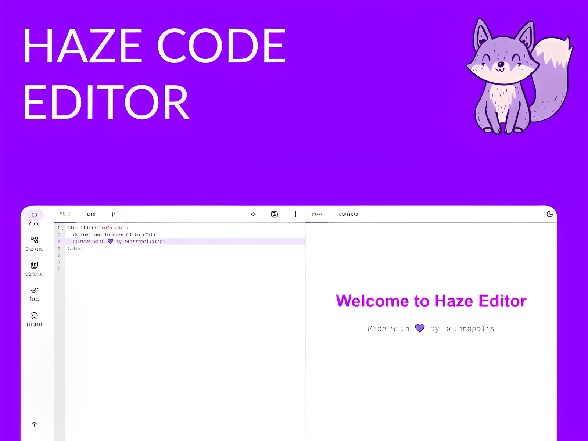
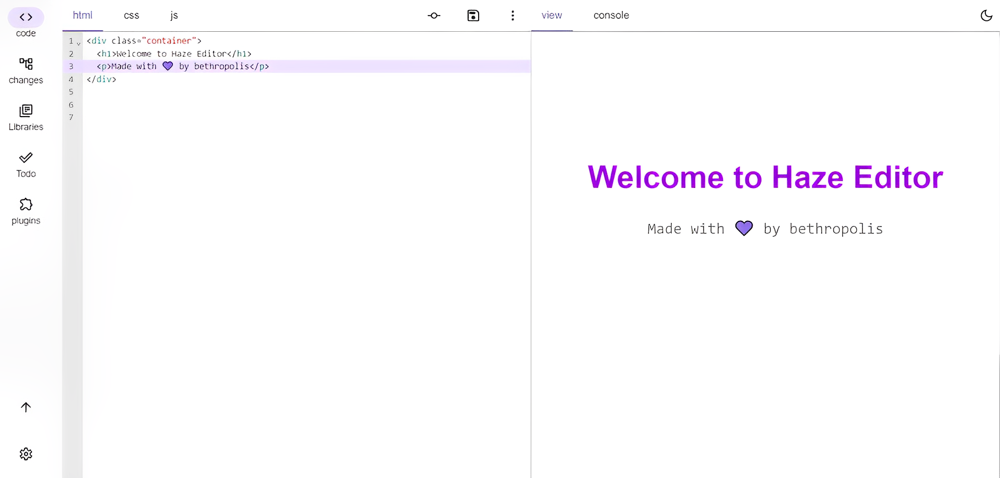
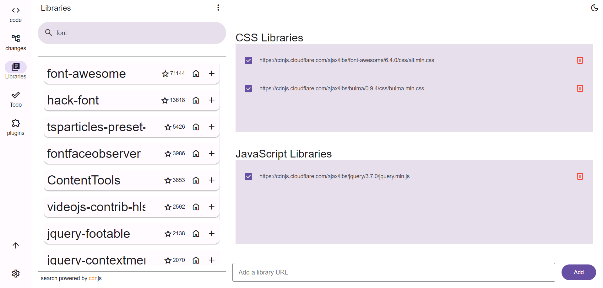
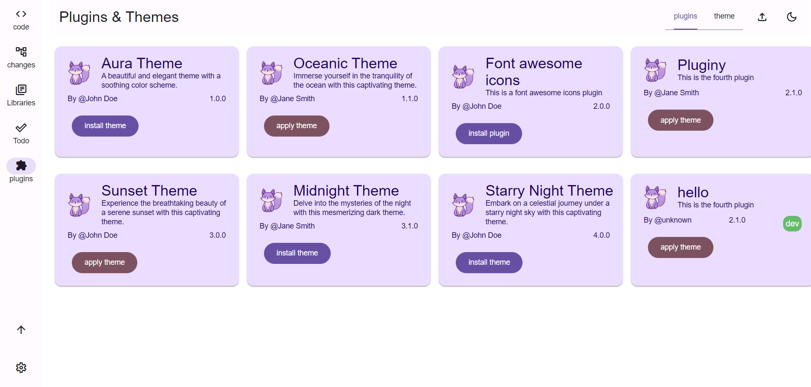
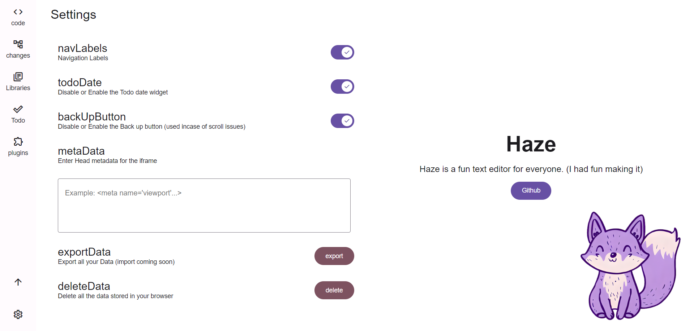

# Haze Editor
An HTML, CSS, JS code editor with version management, Todo app integration, plugins, and more.



## Table of Contents
- [Haze Editor](#haze-editor)
  - [Table of Contents](#table-of-contents)
  - [Introduction](#introduction)
  - [Installation](#installation)
  - [Features](#features)
    - [code editor](#code-editor)
    - [version management](#version-management)
    - [Library management](#library-management)
    - [Todo app](#todo-app)
    - [Plugins](#plugins)
    - [More](#more)
  - [Plugins](#plugins-1)
    - [building a plugin/theme](#building-a-plugintheme)
    - [testing a plugin/theme](#testing-a-plugintheme)
  - [Issues](#issues)
  - [License](#license)

## Introduction
Haze Editor is a powerful code editor that allows you to write and manage HTML, CSS, and JS code. It provides features like version control, library management, integration with a Todo app, and the ability to extend and customize the editor with plugins and themes.

## Installation
To install and run Haze Editor locally, follow these steps:

```shell
git clone https://github.com/haze-editor/haze-editor.git
cd haze-editor
npm install
```

You can now use the following command to run it:
```
npm run dev
```
To build for deployment:
```
npm run build
```

## Features
- Code editor
- Version management
- Library management
- Todo app
- Plugins
- more


### code editor
The code editor in Haze Editor supports HTML, CSS, and JS. It provides features such as syntax highlighting, auto-completion, embedded browser preview, code export, and code import.



### version management
 It comes with a built-in custom-made version control system, allowing you to manage and track changes to your code effectively.
 

### Library management
This allows you to manage external JS & CSS libraries.
The cdnjs API is used to search and get the latest version of a library.



### Todo app
This is an in-built todo list app.
You can keep track of your tasks, and mark them as done.


### Plugins
Extend and customize the editor by adding plugins and themes. Plugins allow you to enhance the functionality of the editor, while themes provide different visual styles.



### More
- Themes: Customize the visual appearance of the editor with various themes.
    
- Settings: Configure and fine-tune the editor according to your preferences.
    

## Plugins
### building a plugin/theme
To build a plugin file you need to create a json file with the following structure:
```json
 {
  "name": "Aura Theme",
  "description": "A beautiful and elegant theme with a soothing color scheme.",
  "version": "1.0.0",
  "image": "path/to/logo.png",
  "type": "theme", // Either "theme" or "plugin"
  "file": "path/to/theme/file.css", // For type: "plugin", provide the path to the JS file
  "author": "John Doe"
}

 ```
### testing a plugin/theme
To try out your plugin or theme, open the Haze Editor, go to the Plugins section, and click the "Load plugin" button.

## Issues
If you encounter any problems or have suggestions for improvement, please report them on [Github issues](https://github.com/bethropolis/haze/issues).
## License
Nothing says more open source than MIT. <br><br>
Happy Coding! 💜

