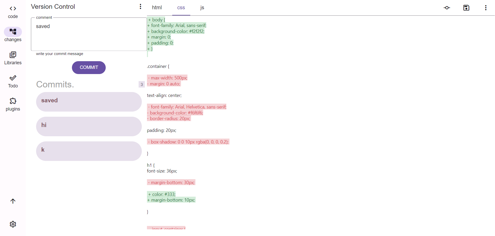

# Haze Editor
a html, css, js code editor with version management, Todo app intergration, plugins and more.

## Installation
```
git clone https://github.com/haze-editor/haze-editor.git
cd haze-editor
npm install
```

you can now use the following command to run it:
```
npm run dev
```


## Features
- Code editor
- Version management
- Plugins
- Todo app
- Library management


### code editor
- html, css, js
- syntax highlight
- auto-completion

### version management
 This is an in-built custom made version control system.
 


## License
MIT

